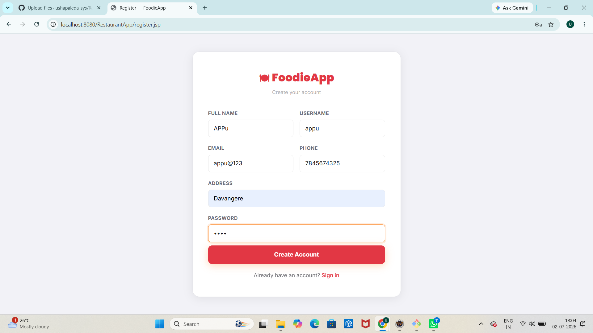

# 🍽️ Restaurant Ordering Web Application

A dynamic restaurant ordering web application built using **Java Servlets, JSP, JDBC, MySQL, HTML, CSS, Bootstrap, and Apache Tomcat**.

## 🚀 Features

* User Registration & Login
* Restaurant Listing
* Restaurant Menu
* Add to Cart
* Place Orders
* Order History
* User Profile
* Responsive Design

## 🛠️ Technologies Used

* Java
* JSP
* Servlets
* JDBC
* MySQL
* HTML
* CSS
* Bootstrap
* Apache Tomcat

## 📸 Screenshots

### Login Page

### Register Page

### Home Page

### Restaurant Page

### Menu Page

### Cart Page

### Orders Page

### Profile Page

## 🎥 Demo Video

Download and watch the project demo from this repository or replace this section with a YouTube link if you upload your demo there.

## ⚙️ Installation

1. Clone the repository.
2. Import the project into Eclipse IDE.
3. Configure Apache Tomcat.
4. Import the MySQL database.
5. Run the project.

## 👩‍💻 Developed By

**Usha P T**

GitHub: https://github.com/ushapaleda-sys
